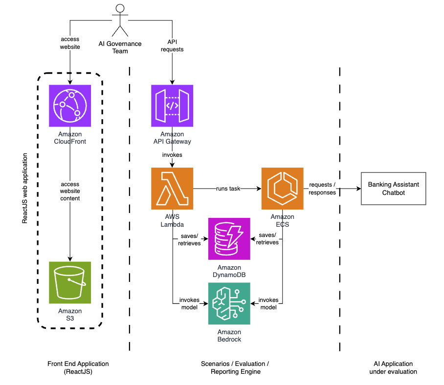

# Responsible AI Scenarios Evaluator

This application allows customers to run automated tests of their applications' adherence to responsible AI principles. The platform evaluates applications across eight key responsible AI pillars:

- **Fairness**: Considering impacts on different groups of stakeholders
- **Explainability**: Understanding and evaluating system outputs  
- **Privacy and Security**: Appropriately obtaining, using, and protecting data and models
- **Safety**: Preventing harmful system output and misuse
- **Controllability**: Having mechanisms to monitor and steer AI system behavior
- **Veracity and Robustness**: Achieving correct system outputs, even with unexpected or adversarial inputs
- **Governance**: Incorporating best practices into the AI supply chain, including providers and deployers
- **Transparency**: Enabling stakeholders to make informed choices about their engagement with an AI system

## Architecture

### System Components

The platform consists of:
- **Web UI**: React-based frontend built with Vite for configuring evaluations and viewing results
- **API Gateway**: REST APIs with API key authentication for managing evaluation requests
- **Lambda Functions**: Handle API requests, scenario management, and orchestrate evaluations
- **ECS Fargate**: Runs the evaluation engine that generates questions and tests applications using Amazon Bedrock
- **DynamoDB**: Stores scenarios, evaluation reports, questions, and results with point-in-time recovery
- **S3 + CloudFront**: Hosts the web application with secure distribution
- **VPC**: Secure network isolation for ECS tasks

### Architecture Diagram



### End-to-End Application Flow

1. **User Access**: User accesses the React web application through CloudFront distribution, which serves static content from S3 and provides secure, global content delivery.

2. **Scenario Creation Request**: User submits scenario details (name, description, and number of questions per responsible AI category) through the web interface to create a reusable test scenario.

3. **AI-Powered Question Generation**: Lambda function is triggered asynchronously to generate targeted scenario questions using Amazon Bedrock (Claude 3.7 Sonnet), creating questions designed to test each of the eight responsible AI pillars.

4. **Scenario Storage**: Generated scenario questions are stored in DynamoDB with metadata including category classification, creation timestamps, and scenario associations for future reuse.

5. **Scenario Review and Management**: User reviews the AI-generated scenario questions through the web interface and can edit, delete, or create additional questions as needed to refine the test scenarios.

6. **Evaluation Configuration**: User configures a new evaluation by selecting an existing scenario and providing target application details including API endpoint, authentication headers, request/response field mappings, and evaluation parameters.

7. **Evaluation Initialization**: Lambda function validates and stores the evaluation configuration in DynamoDB, then triggers an ECS Fargate task asynchronously to perform the comprehensive evaluation process.

8. **Containerized Evaluation Execution**: ECS Fargate task launches in a secure VPC environment, retrieves evaluation parameters and scenario questions from DynamoDB, and begins the automated testing process.

9. **Target Application Testing**: ECS evaluator systematically sends scenario questions to the target AI application's API endpoint, collects responses, and handles any connection errors or timeouts during the testing phase.

10. **AI-Powered Response Analysis**: Each application response is analyzed against its corresponding responsible AI pillar using Amazon Bedrock, generating detailed considerations, verification guidelines, and preliminary assessments that are stored in DynamoDB alongside the original responses.

11. **Human Review and Reporting**: User reviews the evaluation results through the web interface, provides human evaluation scores (1-5 scale) for each question-response pair, adds optional comments, and generates comprehensive PDF reports for documentation and compliance purposes.

## Prerequisites

- AWS CLI configured with appropriate permissions (including Bedrock access)
- Node.js and npm (for CDK CLI and UI build)
- Python 3.13+
- Docker (for building ECS container images)
- AWS CDK CLI (`npm install -g aws-cdk@latest`)
- Access to Amazon Bedrock Claude 3.7 Sonnet model (`us.anthropic.claude-3-7-sonnet-20250219-v1:0`)

## Deployment

### Quick Deployment
```bash
./build.sh
./deploy.sh
```
Get the web application URL from the deployment output.

The deployment creates the following stacks in order:
- `rai-01-storage`: DynamoDB tables for scenarios, evaluations, and questions
- `rai-02-webapp`: S3 bucket and CloudFront distribution for the web UI
- `rai-03-network`: VPC, subnets, and security groups
- `rai-04-compute`: ECS cluster and Fargate task definitions
- `rai-05-api`: API Gateway, Lambda functions, and integrations

## Usage

### Creating Scenarios
1. Access the web application using the CloudFront URL from deployment output
2. Navigate to "Manage Scenarios" to create reusable test scenarios
3. Provide scenario name, description, and number of questions per category
4. The system uses Amazon Bedrock to generate targeted questions for each responsible AI pillar

### Running Evaluations
1. Go to "Evaluate" to create a new evaluation
2. Select an existing scenario or create a new one
3. Configure your application endpoint:
   - API endpoint URL
   - Request headers (if needed)
   - Request body parameters
   - Input prompt key (field name for questions)
   - Output response key (field name for responses)
4. The system will:
   - Send generated questions to your application
   - Collect responses
   - Use AI to analyze responses against responsible AI principles
   - Generate evaluation considerations for human review

### Reviewing Results
1. View evaluation results in the "Results" section
2. Review AI-generated considerations for each question/response pair
3. Provide human evaluation scores (1-5 scale) for each question
4. Export results as PDF reports
5. Track overall scores and category breakdowns

## Troubleshooting

### Common Issues
1. **Bedrock Access**: Ensure your AWS account has access to Claude 3.7 Sonnet model
2. **CDK Bootstrap**: Run `cdk bootstrap` if you encounter deployment errors
3. **Docker**: Ensure Docker is running for ECS container builds
4. **Node.js Version**: Use Node.js 18+ for optimal compatibility
5. **Python Version**: Python 3.13+ is required for Lambda runtime compatibility

### Logs and Monitoring
- CloudWatch logs are automatically created for all Lambda functions and ECS tasks
- API Gateway access logs are enabled for request tracking
- DynamoDB point-in-time recovery is enabled for data protection

## Cleanup

To remove all deployed resources:

```bash
./destroy.sh
```

**Note**: This will permanently delete all data including scenarios, evaluations, and results.

## Development

### CDK Commands
- **Synthesize CloudFormation templates:** `cdk synth`
- **List all stacks:** `cdk ls`
- **Compare deployed vs current state:** `cdk diff`
- **View CDK documentation:** `cdk docs`

## Technology Stack

### Backend
- **AWS CDK**: Infrastructure as Code using Python
- **Amazon Bedrock**: AI model integration (Claude 3.7 Sonnet)
- **AWS Lambda**: Serverless API functions (Python 3.13)
- **Amazon ECS Fargate**: Containerized evaluation engine
- **Amazon DynamoDB**: NoSQL database with point-in-time recovery
- **Amazon API Gateway**: REST API with API key authentication
- **Amazon VPC**: Network isolation and security

### Frontend
- **React 18**: Modern JavaScript framework
- **Vite**: Fast build tool and development server
- **Material-UI**: Component library for consistent design
- **Recharts**: Data visualization for evaluation results
- **Axios**: HTTP client for API communication

## Contributing

Please read [CONTRIBUTING.md](CONTRIBUTING.md) for details on our code of conduct and the process for submitting pull requests.

## License

This project is licensed under the terms specified in the [LICENSE](LICENSE) file.

